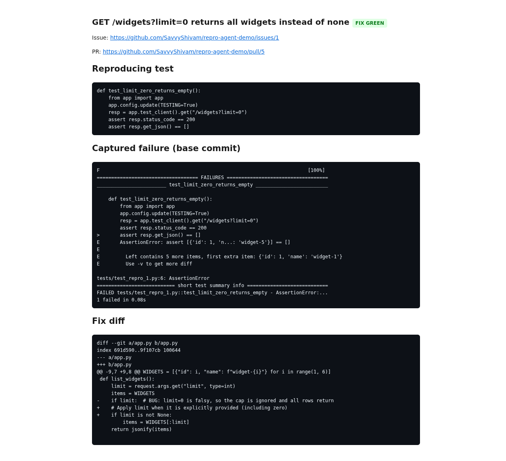
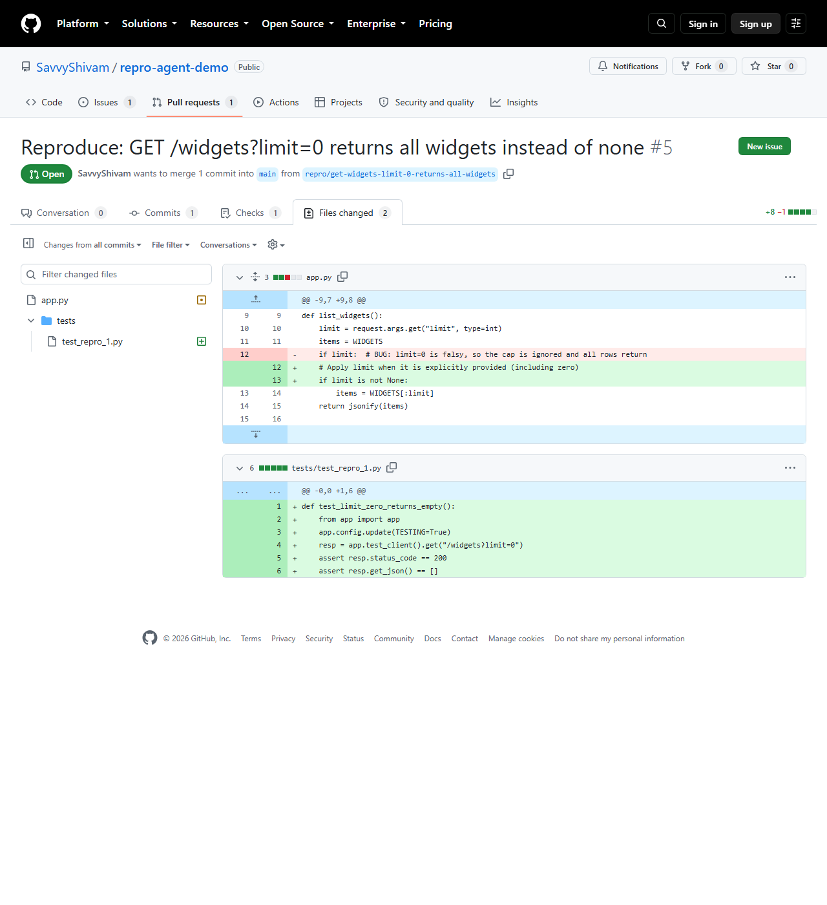

# issue-repro-agent (Python)

Turn a GitHub bug report into a pull request that **reproduces the bug with a
failing test** — and fixes it when it can.

One `slr_live_` key, three Solari primitives, one linear pipeline:

```text
GitHub issue URL
      │
      ▼
Solari Browser   ── stealth Chrome opens the issue, reads its code blocks
      │
      ▼
Solari Sandbox   ── git.clone the repo, install it, write the repro test, run it
      │              → captures the failure ("red")
      ▼
LLM (Groq/Claude)── proposes the fix as whole-file rewrites  (skipped with --dry-run)
      │
      ▼
Solari Sandbox   ── apply, re-run the test ("green", or "unresolved")
      │              git checkout -b, commit, git.push  (per-call PAT, no shell)
      ▼
GitHub API       ── opens the PR
      │
      ▼
Solari Sandbox   ── serves an HTML report on :8000 via preview_url
Solari Browser   ── screenshots it → report.png
```

A real run against [`SavvyShivam/repro-agent-demo#1`](https://github.com/SavvyShivam/repro-agent-demo/issues/1)
opened [**PR #5**](https://github.com/SavvyShivam/repro-agent-demo/pull/5) — the
one-line fix plus the regression test, tests green:





## Run it

```bash
cd examples/issue-repro-agent-py
pip install -e .
cp .env.example .env        # fill in at least SOLARI_API_KEY
set -a && . ./.env && set +a

# no LLM key needed: reproduce + report + push the failing test
python -m repro_agent --issue-url "https://github.com/SavvyShivam/repro-agent-demo/issues/1" --dry-run

# full run: reproduce, fix, open the PR  (needs GROQ_API_KEY or ANTHROPIC_API_KEY)
python -m repro_agent --issue-url "https://github.com/SavvyShivam/repro-agent-demo/issues/1"
```

Flags: `--dry-run` (no LLM), `--no-report`, `--max-fix-attempts N` (default 2),
`--out PATH` (screenshot path).

Exit codes: `0` ok · `2` no parseable repro steps/test · `3` bug did not
reproduce · `1` unexpected error.

The companion fixture is [`repro-agent-demo`](https://github.com/SavvyShivam/repro-agent-demo):
a ~40-line Flask API with one planted bug (`GET /widgets?limit=0` returns every
row because the handler guards with `if limit:` and `0` is falsy).

## How it works

| Module | Does | Solari surface |
|---|---|---|
| `issue.py` | launches a stealth browser, `page.evaluate`s the rendered issue DOM for its text + code blocks (GitHub drops the ` ``` ` fences); first `python` block is the repro test, else the LLM writes one | `solari-browser` |
| `workspace.py` | creates a sandbox, `git.clone --depth 1`, detects `pytest` / `maven` / `npm`, runs setup | `solari-sandbox` |
| `repro.py` | writes `tests/test_repro_1.py`, runs it; "reproduced" == the test fails | `sandbox.commands` / `files` |
| `llm.py` | `propose_file_edits()` / `propose_repro_test()`; provider picked by key — `GROQ_API_KEY` (`openai/gpt-oss-120b`) or `ANTHROPIC_API_KEY` (`claude-sonnet-5`), `REPRO_AGENT_MODEL` to override | Groq / Anthropic |
| `fix.py` | feeds the model the failing test + traceback + the repo's non-test sources, applies **whole-file rewrites** (weak models mangle unified diffs), re-runs, retries once, `git checkout` reverts between tries; never edits test files | `sandbox` |
| `publish.py` | `git checkout -b`, commit, `git.push` with a per-call PAT, then `POST /repos/{o}/{r}/pulls` (reuses an open PR on 422) | `sandbox.git` + `httpx` |
| `report.py` | renders `report.html`, serves it from the sandbox, screenshots it through the browser | `sandbox.preview_url` + `browser` |
| `__main__.py` | wires the pipeline, resolves flags, `sbx.kill()` in `finally` | — |

## Design notes

- **The reproduction is the deliverable.** If the fix does not converge in
  `--max-fix-attempts`, the branch and PR still go up, labelled
  *"reproduced; fix unresolved"*, carrying just the failing test. An agent that
  reliably reproduces bugs and writes regression tests is already useful.
- **Whole-file rewrites, not diffs.** `openai/gpt-oss-120b` (and most non-frontier
  models) emit unified diffs with broken `@@` ranges that `git apply` rejects.
  Asking for the complete new file and writing it with `sandbox.files.write` is
  deterministic; the PR's diff is recovered with `git diff` afterwards.
- **Planted-bug fixture** rather than a live open-source issue: the submission
  is judged on the agent, and a deterministic target keeps the demo honest and
  fast.
- **Free-tier friendly:** one sandbox, one browser, a few minutes, well under
  the session cap. On the Starter plan (2 sandboxes) the fix step can fan out —
  see `--parallel-fix` (optional).
- **Java / Spring Boot** works through the same `maven` path, but the `base`
  template has no JDK; the right approach is a Solari **snapshot** with JDK +
  Maven pre-warmed, then `from_snapshot` for instant starts. Documented, not
  shipped in v1.

## Tests

```bash
pip install -e ".[dev]" && pytest -q      # 39 unit tests, ~1s
python demo.py                             # local planted-bug self-check
```

Unit tests mock the Solari clients with fakes that mirror the real SDK shapes
(`CommandResult.exitCode`, `FsEntry.name`, keyword-only `commands.run`,
`preview_url` → dict). The full end-to-end run needs real Solari + an LLM key +
a GitHub PAT and is a manual step, not CI.
